<p align="center">
  
</p>

<h1 align="center">OSPA SuryaOCR</h1>

<p align="center">
  <strong>Advanced Document Processing Framework for Historical Sources</strong>
</p>

<p align="center">
  <a href="https://creativecommons.org/licenses/by-nc/4.0/"></a>
  
  
  
  
</p>

<p align="center">
  <a href="https://github.com/iytedbb/OSPA-SuryaOCR"></a>
  <a href="https://huggingface.co/dbbiyte"></a>
</p>

<hr/>

<p align="center">
  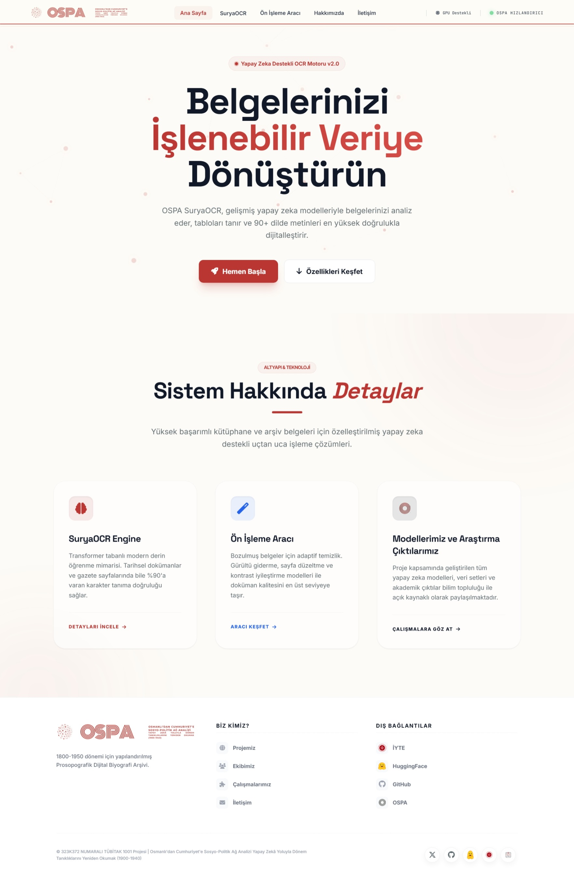
</p>

OSPA SuryaOCR is a comprehensive OCR and document analysis framework designed for high-accuracy text extraction from historical documents, newspapers, and academic texts. Built upon state-of-the-art AI models including **Surya 0.17** and **DocLayout-YOLO**, the system orchestrates a complete digitization pipeline — from raw scans to structured, machine-readable data.

> *"We don't just scan archives; we transform 'Visual Data' into 'Machine-Readable Data'."* — **The OSPA Vision**

## Table of Contents

- [Overview](#overview)
- [Pipeline Showcase](#pipeline-showcase)
- [The Orchestration Journey](#the-orchestration-journey)
- [Performance Benchmarks](#performance-benchmarks)
- [Features](#features)
- [Installation](#installation)
- [Models](#models)
- [Quick Start](#quick-start)
- [Admin Dashboard](#admin-dashboard)
- [Project Structure](#project-structure)
- [Acknowledgments](#acknowledgments)
- [Citation](#citation)
- [License](#license)
- [Support](#support)

## Overview

OSPA SuryaOCR is an **End-to-End Orchestrated Pipeline** designed for the complete digitization of complex historical documents. Rather than providing standalone models, this framework provides a sophisticated orchestration of multiple state-of-the-art AI engines specialized for:

1. **Preprocessing & Recovery**: Automated dewarping ([UVDoc](https://github.com/tanguymagne/UVDoc)), deskewing, and binarization to handle curved book pages and low-quality scans.
2. **Structural Intelligence**: Using **[Surya Layout](https://github.com/datalab-to/surya)** and **[DocLayout-YOLO](https://github.com/opendatalab/DocLayout-YOLO)** to identify page types (Newspapers, Books, Documents) and segment them into logical regions.
3. **Advanced OCR Orchestration**: Leveraging the **Surya 0.17 engine** for high-precision multilingual text recognition, applied specifically to the segmented columns and lines.
4. **Structured Output Generation**: Converting raw visual data into structured **Markdown** and **XML** formats, preserving headings, paragraphs, and hierarchical metadata.

### From "Archive Digitization" to "Document Digitization"

As outlined in our project philosophy, there is a critical distinction:

- **Archive Digitization (Visual)**: Scanning a physical document into PDF/JPG. To a machine, this is still just pixels.
- **Document Digitization (Data)**: Converting that image into character-level data. Our pipeline bridges this gap, turning "Visuals" into "Queryable Data Objects".

While SuryaOCR provides powerful base models, our pipeline significantly boosts the final quality by solving real-world digitization challenges:

- **Layout-Aware OCR**: By using **Surya Layout Engine** to segment columns *before* OCR, we prevent the "text bleeding" common in multi-column newspaper scans, ensuring a natural reading order.
- **Warp-Resistant Accuracy**: Historical books often have curved pages. Our **[UVDoc](https://github.com/tanguymagne/UVDoc)** integration flattens these surfaces, increasing character recognition accuracy by up to 30% compared to raw scans.

## Pipeline Showcase

A visual walkthrough of the framework's core capabilities — from raw historical scans to structured machine-readable output.

|                       Original Scan (Double Page)                       |                          Preprocessed Output (Split & Enhanced)                          |
|:-----------------------------------------------------------------------:|:----------------------------------------------------------------------------------------:|
|  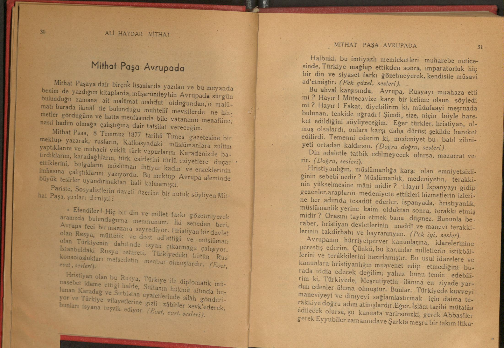          | 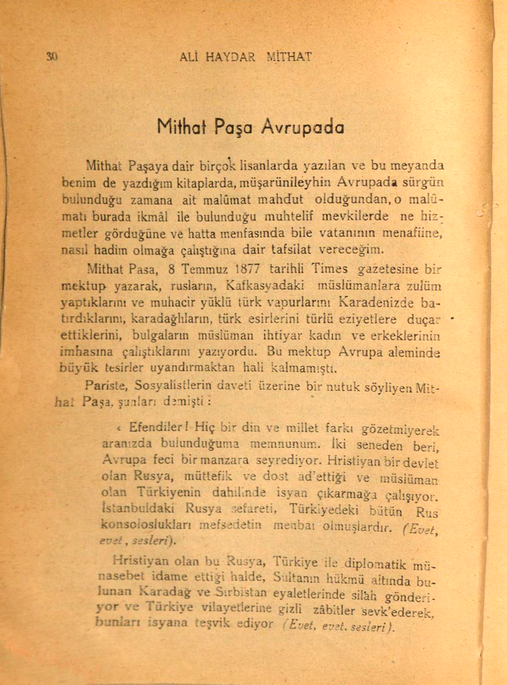 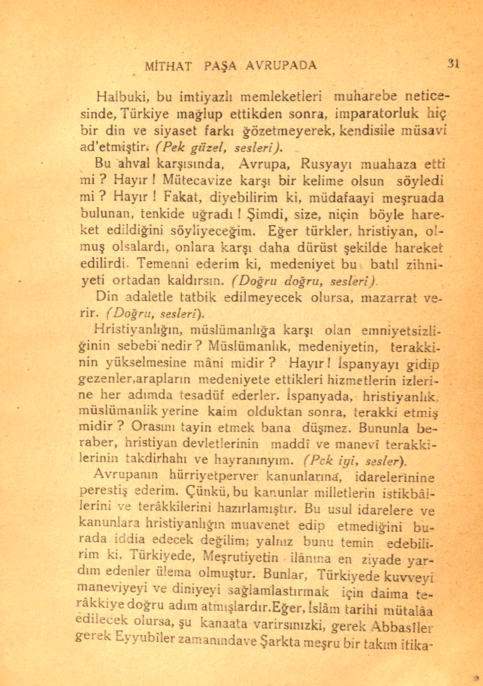 |

|                       Layout Detection (Newspaper)                      |                            Structured XML Output                              |
|:-----------------------------------------------------------------------:|:-----------------------------------------------------------------------------:|
|  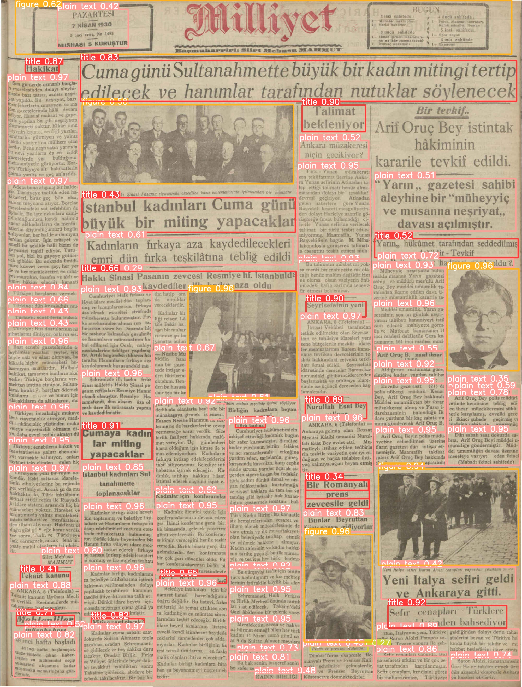             |  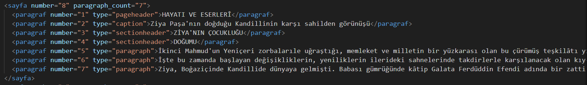                       |

## The Orchestration Journey

Following the technical workflow outlined in our documentation, the pipeline follows five critical stages to ensure data integrity.

### 1. Preprocessing & Page Topology (PyReform & UVDoc)

The journey begins by preparing the document. We tackle common historical challenges: **aged pages**, **faded ink**, and **curved scans**.

- **Page Structure Analysis**: The system first determines whether the input is a single page, a double page, or rotated. Using intelligent detection, we allow for automated splitting of double-page scans.
- **Image Enhancement**: **[py-reform](https://pypi.org/project/py-reform/)** and **OpenCV** (Bilateral Filter, CLAHE) are used to dewarp curved pages and enhance contrast, making the text clearer for the AI.

<p align="center">
  
  <br/>
  <em>Raw double-page scan with curvature, aging, and uneven illumination.</em>
</p>

### 2. Layout Analysis (Selectable Engines)

Before reading a single letter, the system understands the page arrangement. The pipeline offers two high-performance options, with **[Surya 0.17 Layout Engine](https://github.com/datalab-to/surya)** being the default preferred choice for historical text precision. Users can manually switch to **[DocLayout-YOLO](https://github.com/opendatalab/DocLayout-YOLO)**, which remains highly effective for complex, multi-column newspaper structures.

|                  Book Layout (Ziya Paşa)                  |                Close-up Detection                  |
|:---------------------------------------------------------:|:--------------------------------------------------:|
| 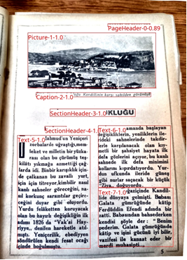| 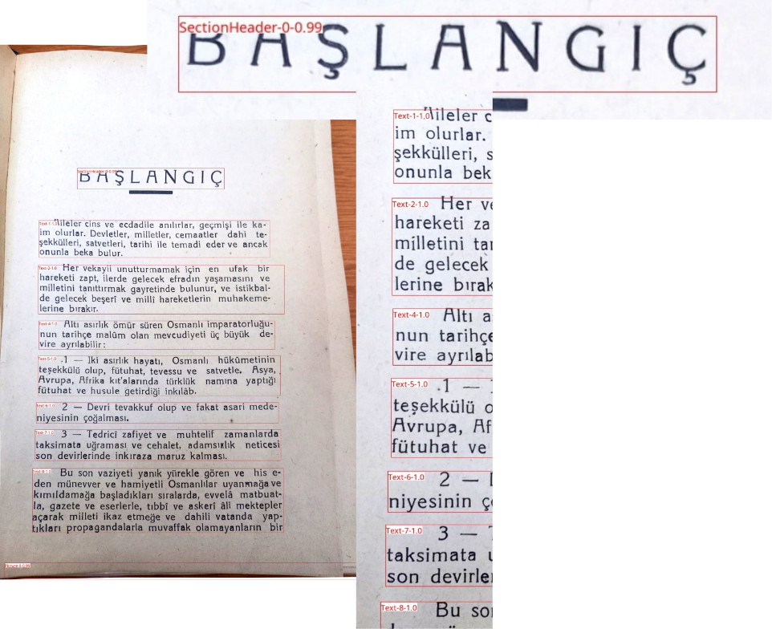 |

The engine identifies distinct region types — `Picture`, `PageHeader`, `Caption`, `SectionHeader`, `Text` — and assigns confidence scores to each detected zone, enabling specialized downstream handling per region type.

### 3. Text Detection (DetectionPredictor)

Once the layout is understood, the **Surya Detection** engine identifies text regions at the pixel level. It draws bounding boxes around every line, ensuring no text is missed, even in the margins.

### 4. Character Recognition (RecognitionPredictor)

This is where the core processing happens. Using the **Vision Transformer (ViT)** architecture, the system reads text contextually. It solves common historical "bleeds" (like 'h' vs 'n' confusion) by analyzing the visual pattern of the entire word.

### 5. Final Formatting (Structured Export)

The processed data is exported into dual formats to serve both quantitative and qualitative research needs.

#### Output Example: Markdown (MD)

*Designed for "Readable and Verifiable Representation".* Clear, tag-free text optimized for human reading and quick control.

```markdown
## Page 117
### House of Lords
**4 July 1881**
Earl de la-Warr: - Regarding the trial of Midhat Pasha taking place in Istanbul...
Lord Granville: - Your Excellency, the whole of Europe...
```

#### Output Example: XML

*Designed for "Structural and Analytic Representation".* Preserves the hierarchy (Page > Paragraph > Sentence > Word) and location data for machine analysis.

<p align="center">
  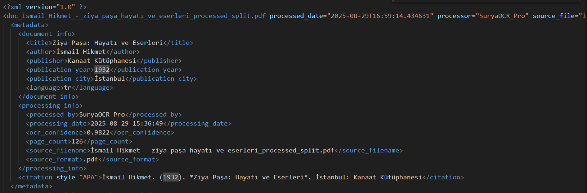
  <br/>
  <em>Rich metadata block: bibliographic info, OCR confidence scores, page counts, and APA-style citations.</em>
</p>

<p align="center">
  
  <br/>
  <em>Page-level paragraph hierarchy with typed regions (pageheader, caption, sectionheader, paragraph).</em>
</p>

## Performance Benchmarks

In extensive testing with the OSPA historical document collection (1900-1940 period), this framework consistently outperformed both legacy and modern alternatives.

<p align="center">
  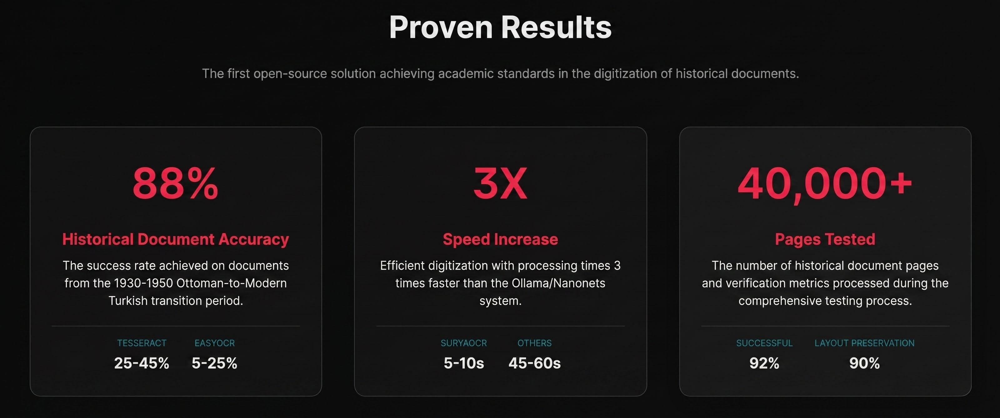
</p>

<p align="center">
  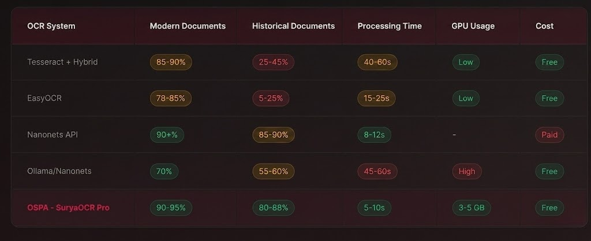
</p>

### Why It Works

- **Tesseract / EasyOCR Issues**: Failed on **historical fonts** ('h' vs 'n' confusion) and complex layouts.
- **LLM Issues**: While promising, LLMs suffered from the **"Loop Problem"** (hallucinating repetitions in long texts) and lacked specific historical context.
- **SuryaOCR Advantage**: Uses **Vision Transformers (ViT)** to perceive words as complete visual patterns within a context, dramatically reducing "character bleeding" in faded historical ink.

## Core Philosophy: From Pixels to Data Objects

Our approach goes beyond simple optical character recognition. As defined in our vision:

- **The Digitization Gap**: Computer systems initially perceive a scanned archive only as a collection of pixels. Our pipeline bridges the gap between a "digital image" and a "digital document".
- **Structural Integrity**: By using **XML for machines** and **Markdown for researchers**, we ensure that the document's layout, hierarchy, and metadata are preserved as a queryable data object.
- **Data over Image**: We transform historical noise (faded ink, yellowed paper) into a verifiable and analyzable digital asset, opening the doors for advanced NLP, socio-political network analysis, and text mining.

> *"We are not just moving documents to a digital environment; we are making them machine-readable, discoverable, and reinterpretable for the modern scholar."*

## Features

- **Surya v0.17 Integration**: Uses the latest Foundation, Detection, and Recognition predictors.
- **DocLayout-YOLO**: Advanced layout detection for complex document structures.
- **Dockerized Environment**: One-command setup with PostgreSQL and model preloading.
- **Dual Database Support**: Automatic fallback to SQLite for local development, PostgreSQL for production.
- **Modern Web UI**: React-based frontend with real-time progress tracking via Server-Sent Events (SSE).
- **Extensive Admin Panel**: Manage books, track OCR progress, and export results in multiple formats.
- **Hardware Optimized**: Fully supports CUDA (RTX 5000 Ada Generation) with high-performance memory management.

## Installation

### Requirements

- Python 3.11+
- Docker & Docker Compose (optional but recommended)
- NVIDIA GPU with 8GB+ VRAM (recommended for OCR performance)

### Option 1: Docker (Recommended)

The easiest way to get started. It handles the database, Python environment, and models automatically.

```bash
# Clone the repository
git clone https://github.com/iytedbb/OSPA-SuryaOCR.git
cd OSPA-SuryaOCR

# Start the application
docker-compose up --build
```

Wait for the `SuryaOCR Processor READY!` message. The web interface will be available at `http://localhost:5000`.

### Option 2: Local Installation (uv)

```bash
# Install uv if not already installed
# See: https://docs.astral.sh/uv/getting-started/installation/

# Clone and enter the project
git clone https://github.com/iytedbb/OSPA-SuryaOCR.git
cd OSPA-SuryaOCR

# Sync dependencies
uv sync

# Run the application
uv run python run.py
```

This will use SQLite by default and require manual model downloads upon first run.

## Models

SuryaOCR integrates several state-of-the-art AI models to handle different stages of the document digitization pipeline:

| Model | Task | Source |
|-------|------|--------|
| **Surya Detection** | Text line & column detection | [datalab-to/surya](https://github.com/datalab-to/surya) |
| **Surya Recognition** | Multilingual Text OCR | [datalab-to/surya](https://github.com/datalab-to/surya) |
| **Surya Layout** | Structural analysis (Headings, Tables) | [datalab-to/surya](https://github.com/datalab-to/surya) |
| **DocLayout-YOLO** | Page type & segment detection | [opendatalab/DocLayout-YOLO](https://github.com/opendatalab/DocLayout-YOLO) |
| **UVDoc** | Document dewarping & straightening | [tanguymagne/UVDoc](https://github.com/tanguymagne/UVDoc) via [py-reform](https://pypi.org/project/py-reform/) |
| **Deskew** | Automated skew correction | [deskew (PyPI)](https://pypi.org/project/deskew/) |

### Preprocessing Pipeline

The preprocessing module uses **[UVDoc](https://github.com/tanguymagne/UVDoc)** for complex document dewarping, ensuring that curved book pages are flattened before OCR. **[DocLayout-YOLO](https://github.com/opendatalab/DocLayout-YOLO)** acts as the primary classifier to determine if a document is a standard book, a multi-column newspaper, or a biography card, enabling specialized processing logic for each type.

## Quick Start

A guided walkthrough of the OSPA SuryaOCR web interface — from upload to download in five steps.

### Step 1 — Access the Web Interface

Open `http://localhost:5000` in your browser. The landing page introduces the platform and its capabilities.

<p align="center">
  
</p>

### Step 2 — Upload Your Document

Drag and drop a PDF (or JPG / PNG / TIFF) file into the upload area, or click **Dosya Seç** to browse.

<p align="center">
  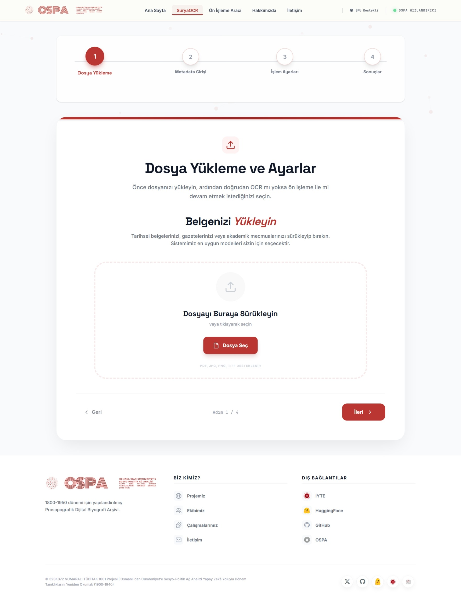
</p>

### Step 3 — Select Processing Mode

Choose between **Normal OCR** (clean documents) and **Preprocessing + OCR** (historical or degraded scans).

<p align="center">
  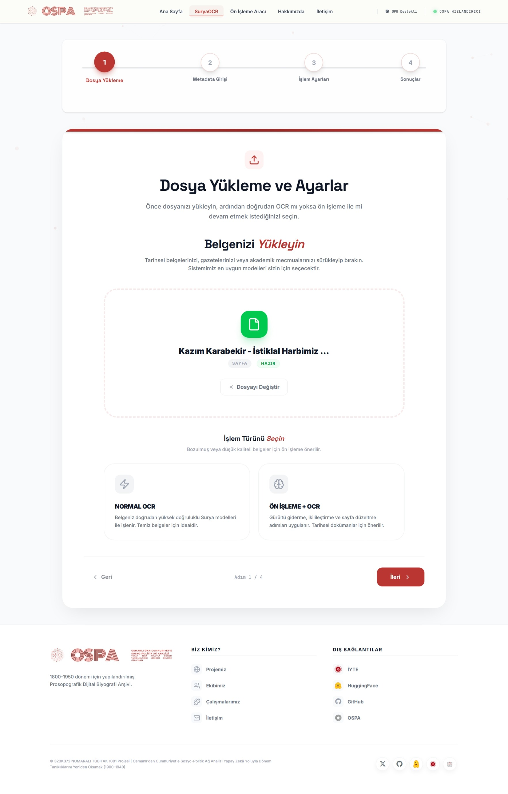
</p>

### Step 4 — Enter Document Metadata

Define the document type (Book / Article / Newspaper / Encyclopedia) and provide bibliographic information. This metadata is embedded in the final XML output.

<p align="center">
  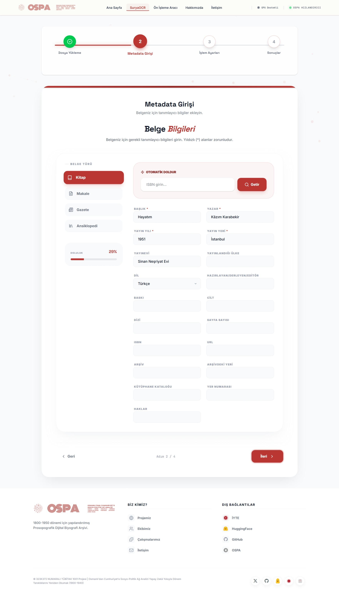
</p>

### Step 5 — Monitor Real-Time Processing

Watch the engine work through your document live. The interface displays page-level progress, elapsed and remaining time, and a real-time engine console with GPU acceleration telemetry.

<p align="center">
  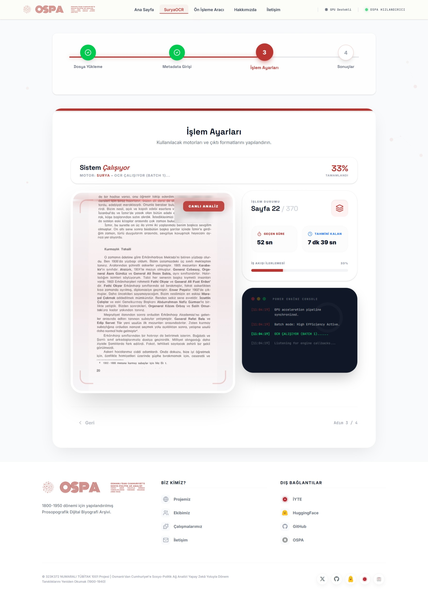
</p>

### Step 6 — Review and Download Results

Once complete, preview both MD and XML outputs side by side and download as separate files or a single ZIP archive.

<p align="center">
  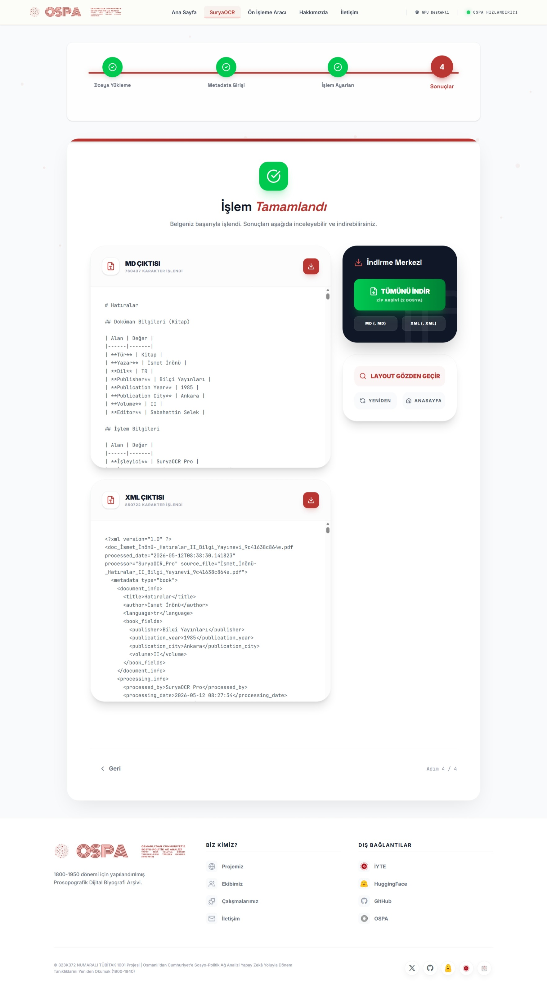
</p>

## Admin Dashboard

Manage your entire digital library at `http://localhost:5000/admin`.

- **Statistics**: View processing counts, VRAM usage, and throughput.
- **Records**: Search, edit metadata (Author, Year, etc.), or delete existing records.
- **Verification**: Preview OCR output side-by-side with original images.

## Project Structure

```
ospa_suryaocr_git/
├── app/                            # Backend (Flask application)
│   ├── database/                   # Database layer
│   │   ├── fonts/                  # Font files for PDF export
│   │   ├── models/                 # DocLayout-YOLO weights (.pt)
│   │   ├── static/                 # Admin panel static assets
│   │   ├── templates/              # Admin panel HTML templates
│   │   ├── veriler/                # Data storage (images, PDFs, preprocessed)
│   │   ├── connection.py           # DB connection handler
│   │   ├── database_service.py     # Core database service
│   │   ├── models.py               # ORM models
│   │   ├── operations.py           # CRUD operations
│   │   └── name_variants.py        # Name normalization logic
│   ├── models/                     # Application-level model definitions
│   │   └── __init__.py             # ORM Model Definitions
│   ├── modules/
│   │   ├── admin/                  # Admin panel routes
│   │   ├── common/                 # Shared utilities
│   │   └── ocr/                    # Core OCR logic
│   │       ├── SuryaOCR_backend.py         # Surya engine integration
│   │       ├── GazeteOCRProcessor.py       # Newspaper-specific OCR
│   │       ├── on_isleme_main.py           # Preprocessing pipeline
│   │       ├── DocumentMetadata.py         # Metadata extraction
│   │       ├── ProcessingProgressTracker.py # Real-time progress (SSE)
│   │       ├── database_integration.py     # OCR-to-DB bridge
│   │       └── routes.py                   # OCR API endpoints
│   ├── static/                     # Frontend assets & example images
│   │   ├── dist/                   # Compiled React build
│   │   ├── admin/                  # Admin panel assets
│   │   ├── comparison/             # Before/after comparison images
│   │   └── ornekler/               # Sample document images
│   └── templates/                  # HTML templates (landing, info pages)
├── assets/                         # README & documentation images
├── frontend/                       # React frontend source
│   ├── src/
│   │   ├── components/             # UI components
│   │   │   ├── FileUploader.jsx
│   │   │   ├── LayoutViewer.jsx
│   │   │   ├── MetadataForm.jsx
│   │   │   ├── ProcessingView.jsx
│   │   │   ├── ResultsView.jsx
│   │   │   ├── SettingsPanel.jsx
│   │   │   └── StepProgressBar.jsx
│   │   └── hooks/
│   │       └── useOCR.js           # OCR state management hook
│   ├── package.json
│   └── vite.config.js
├── scripts/                        # Utility & migration scripts
│   ├── migration.py
│   └── ocr_migration.py
├── .dockerignore
├── .gitignore
├── .python-version
├── CITATION.bib                    # Citation information (BibTeX)
├── config.py                       # Application & model configurations
├── Dockerfile
├── docker-compose.yml              # Service orchestration (App + Postgres)
├── main.py                         # Alternative entry point
├── preload_models.py               # Script to pre-cache AI models
├── pyproject.toml                  # Project metadata and dependencies
├── README.md
├── requirements.txt                # Legacy/Compatibility dependency list
├── run.py                          # Main entry point
├── setup.py                        # Package installation script
├── TEST_INSTRUCTIONS.md            # Testing & verification guide
└── uv.lock                         # Deterministic dependency lock file
```

## Acknowledgments

This work is supported by:

**TUBITAK (The Scientific and Technological Research Council of Turkey)**
Project No: 323K372

### Contributors

- Dr. Mustafa İLTER — Izmir Institute of Technology
- Emre ONUÇ — Pamukkale University

## Citation

If you use this framework in your research, please cite:

```bibtex
@software{OSPA-SuryaOCR-2026,
  title     = {OSPA SuryaOCR - Advanced Document Processing Framework},
  author    = {İlter, Mustafa and Onuç, Emre},
  year      = {2026},
  publisher = {GitHub},
  url       = {https://github.com/iytedbb/OSPA-SuryaOCR},
  note      = {Supported by TUBITAK Project No: 323K372. Built on Surya OCR 0.17 and DocLayout-YOLO},
  license   = {CC-BY-NC-4.0}
}
```

## License

This project is licensed under **CC BY-NC 4.0** (Creative Commons Attribution-NonCommercial 4.0 International).

## Support

For issues, bug reports, or feature requests:

- **Email**: mustafailter@iyte.edu.tr
- **GitHub**: [github.com/iytedbb/OSPA-SuryaOCR](https://github.com/iytedbb/OSPA-SuryaOCR)
- **Hugging Face Models**: [huggingface.co/dbbiyte](https://huggingface.co/dbbiyte)
